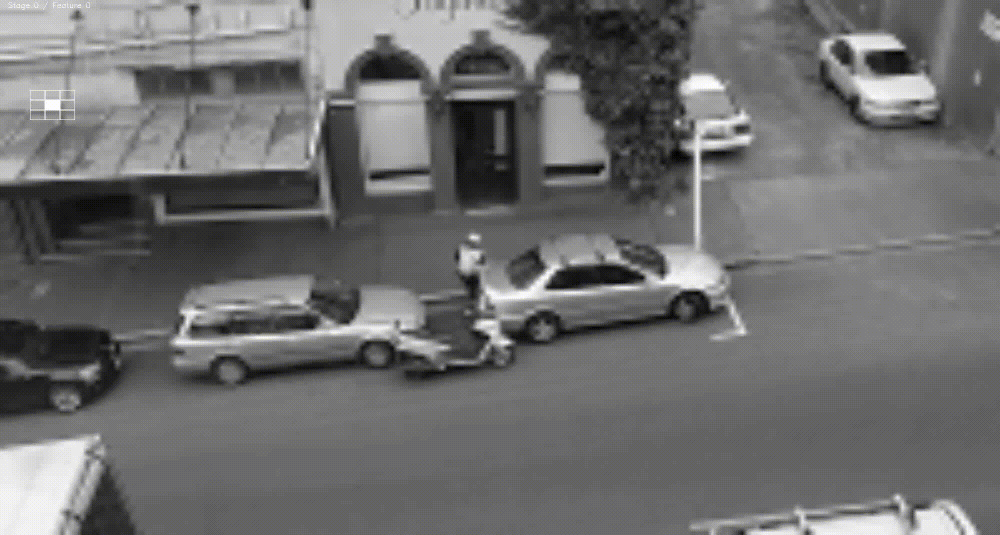

# Detecting things with OpenCV

## Morality of this project

Q: _What the fuck Chris, you're weaponising the ability to spot parking wardens, this will lead to people driving their cars more. Why?_

A: OK, it's not smart to weaponise things, but I kind of assume everything has already been weaponised. But this one isn't for the moral position of liberating all the weapons, it's just that I want to learn an object recognition / learning toolkit and my desk window means I keep telling other Petridish folks when I spot the parking warden.

The parking warden wears a distinctive enough safety jacket that we could probably do this by spotting 50 pixels of high-viz yellow and dispense with the clever learning toolkits anyway.

## Reference points

- Installed OpenCV binaries from https://github.com/jabelone/OpenCV-for-Pi on Pi
- Original sample images: https://chris.bur.gs/images/8-stafford-20180901.tgz
- http://note.sonots.com/SciSoftware/haartraining.html a tutorial, but this seems out of date?
- http://answers.opencv.org/question/39160/opencv_traincascade-parameters-explanation-image-sizes-etc/
- http://coding-robin.de/2013/07/22/train-your-own-opencv-haar-classifier.html
- https://docs.opencv.org/3.3.0/dc/d88/tutorial_traincascade.html

## Some tips & notes

> A general rule that works for a variety of setups is to take a numPos:numNeg ration of 1:2.

> Increasing positive samples gives better generalisation of model. Increasing negative samples decreases false positives.

> Negative images should be larger than model size (default size is 24x24).
[source](http://answers.opencv.org/question/39160/opencv_traincascade-parameters-explanation-image-sizes-etc/)

## Workflow

### Obtain source images

Source images were captured, mostly from the future camera location, all of our Dunedin Parking Wardens.

I used https://github.com/JoakimSoderberg/imageclipper to quickly extract positive matches. This creates new images in a subdirectory imageclipper.

Adding these sample images to the git repo made it really huge, which is no good if it's test data. So I've split the source and negative images out, and am keeping only the positive training set in git.

- Original positive data set https://chris.bur.gs/images/8-stafford-20180901.tgz (included in repo)
- Negative data set https://chris.bur.gs/images/8-stafford-20180901-negative.tgz - this is all various shots of the street, from the same source images as the positive dataset. I've crudely cropped these to exclude the positive images, and so these are often different sizes (eg only the left side of the image).
- Testing data set https://chris.bur.gs/images/8-stafford-20180901-negative.tgz - this is a series of images that is not included in the positive or negative data set (extracted frames from a couple of movies).

### Models

I'm trying three different models to experiment. These are:

- `warden-head+torso`, using images that are just the head and torso of the warden (bright white or silver helmet, hiviz safety jacket with black markings)
- `warden-fullbody`, using images that show the warden including dark legs (whether standing or seated on the scooter)
- `warden-bike`, using the motor scooter of the warden

So in many of the steps below, I've created three folders of positive images and am repeating the process for each of those three.

### Resize positive source images

Suspecting that large source images might interfere with training (you can't ever find a 1000x1000px image in a 500x500px negative training sample). So I'm resizing the positive images to sizes smaller than the positive/negative training set.

`mogrify -resize 160x *png`

And then regenerate the .dat files for the positive training entries.

```
for ii in warden-bike warden-head+torso warden-fullbody ; do
  find ./samples/positive/$ii/ -name '*png' -exec identify -format '%i 1 0 0 %w %h\n' {} > $ii.dat \; ;
done
```

### Create .vec file from .dat file

`-num` here is done by `wc -l`

```
for ii in warden-bike warden-head+torso warden-fullbody ; do
  NUM=$(wc -l $ii.dat)
  opencv_createsamples -info $ii.dat -vec $ii.vec -bg negative.txt -num $NUM
done
```

```
LEARNSTAGES=5
NUMNEG=$(wc -l negative.txt)
for ii in warden-bike warden-head+torso warden-fullbody ; do
  NUMPOS=$(wc -l $ii.dat)
  mkdir -p data/$ii
  opencv_traincascade -data data/$ii -vec $ii.vec -bg negative.txt -numPos $NUMPOS -numNeg $NUMNEG -numStages $LEARNSTAGES -featureType LBP
done
```

### Test our training against the dataset

```
opencv_visualisation --image=./samples/testing/Screenshot-from-2018-09-01-22-32-10-sm.png --model=./data/warden-fullbody/cascade.xml --data=./data/warden-fullbody/
```

This seems to show the visualiser looking in the top left corner, which makes me think I've done something wrong with the model/sizes?



What's with that?
